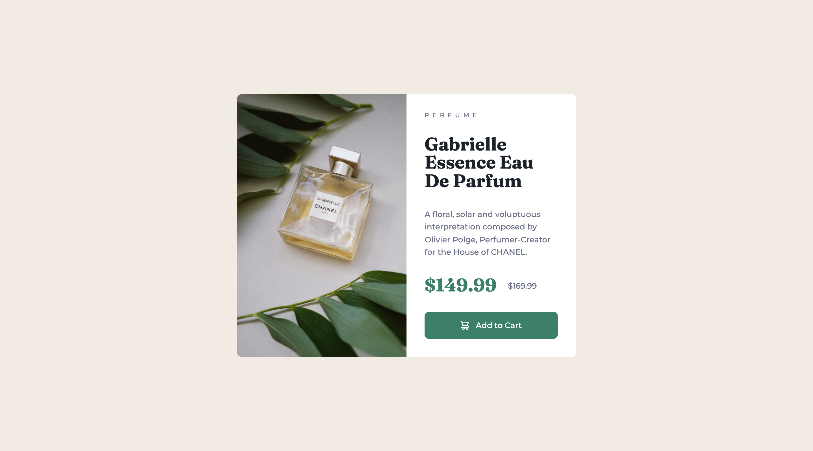

# Frontend Mentor - Product preview card component solution

This is a solution to the [Product preview card component challenge on Frontend Mentor](https://www.frontendmentor.io/challenges/product-preview-card-component-GO7UmttRfa).

## Table of contents

- [Overview](#overview)
  - [The challenge](#the-challenge)
  - [Screenshot](#screenshot)
  - [Links](#links)
- [Process](#process)
  - [Built with](#built-with)
  - [What I learned](#what-i-learned)
  - [Continued development](#continued-development)
  - [Useful resources](#useful-resources)
- [Author](#author)

## Overview

### The challenge

Users should be able to:

- View the optimal layout depending on their device's screen size
- See hover and focus states for interactive elements

### Screenshot



### Links

- Solution URL: [https://github.com/jeanpierretouma/frontend-mentor-product-preview-card-component](https://github.com/jeanpierretouma/frontend-mentor-product-preview-card-component)
- Live Site URL: [https://jeanpierretouma.github.io/frontend-mentor-product-preview-card-component/](https://jeanpierretouma.github.io/frontend-mentor-product-preview-card-component)

## Process

### Built with

- Semantic HTML5 markup
- CSS custom properties
- Flexbox

### What I learned

1. The first thing I learned while building this project was how to use the ```<picture>``` element. I tried to implement the responsivity of images in previous projects by using the ```<picture>``` element but failed to get it to work. However, after some research, I understood the scope in which this element works and the sub-elements required to get it working. Here is a snippet of the index.html file that shows how the ```<picture>``` element should be structured:

    The indented source element specifies the file path, responsive width/height, and the type of the targeted resource. The image element on the other hand is the fallback image that the browser will show in case none of the specified widths are detected by the browser, that's also why the image element is required for the picture element to work properly.

    ```html
    <picture>
      <source srcset="assets/images/image-product-mobile.jpg" media="(max-width: 557px)" type="image/jpeg" />
      
    </picture>
    ```

2. The second thing I learned while building this project was how to use Flexbox efficiently by using better flexbox property values and understanding how they work in different circumstances.

### Continued development

I'm satisfied with the way I built this project because it looks quite close to the design proposed in the challenge and it works well. However, after some testing on different browsers and devices, I found out that the product card image does not cover the entire height of the card on old browsers such as Safari on iOS 9. This issue occurred while building this project but I found a way to make it work, yet it seems that it needs fallback techniques to make it work on older devices.

### Useful resources

- [Flexbox Froggy](https://flexboxfroggy.com/) - This Flexbox game helped me understand how Flexbox properties work in different scenarios. I'd recommend it to anyone still learning Flexbox.
- [<picture>: The Picture element](https://developer.mozilla.org/en-US/docs/Web/HTML/Element/picture) - The Picture element doc helped me understand how to use the Picture element properly. I'd recommend it to anyone looking for the best way to make images responsive in their projects.

## Author

- Website - [Jean-Pierre Touma](https://github.com/jeanpierretouma)
- Frontend Mentor - [@jeanpierretouma](https://www.frontendmentor.io/profile/jeanpierretouma)